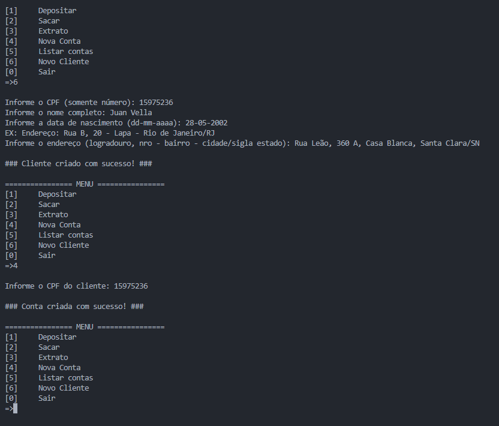

# Sistema Bancário Orientado a Objetos

Um sistema bancário desenvolvido em Python aplicando conceitos de Programação Orientada a Objetos (POO).
Este projeto foi construído como evolução do sistema anterior (estruturado), trazendo abstração, herança, encapsulamento e polimorfismo para deixar o código mais escalável, reutilizável e organizado.

## Mentoria

Projeto criado durante a imersão em Python do BootCamp Santander + DIO, com orientação de mentores e prática colaborativa.

## Tecnologias

 
- Python 3


- Visual Studio Code

## O que aprendi e apliquei

Paradigma: Programação Orientada a Objetos (POO)

Conceitos aplicados:

Classes e Objetos

Herança

Abstração

Encapsulamento

Polimorfismo

Classes abstratas (ABC)

Métodos especiais (__str__)

Tratamento de exceções (try/except)

Listas e Dicionários para armazenar clientes e contas

## Funcionalidades
Depósito — Adiciona valores ao saldo da conta.

Saque — Permite retiradas com limite de valor e quantidade por cliente.

Extrato — Exibe movimentações e saldo disponível.

Novo Cliente — Cadastro de pessoas físicas (nome, CPF, data de nascimento, endereço).

Nova Conta — Criação de conta vinculada a clientes existentes.

Listar Contas — Exibe todas as contas criadas no sistema.

## Novidades nesta versão

Comparado ao sistema bancário estruturado, foram aplicadas as seguintes melhorias:

POO completa: implementação de Cliente, PessoaFisica, Conta, ContaCorrente, Transacao, Saque, Deposito e Historico.

Encapsulamento de saldo e histórico de transações.

Polimorfismo aplicado na sobreposição do método sacar da classe ContaCorrente.

Histórico estruturado: todas as transações (saques e depósitos) são registradas com valor, tipo e data.

Classes abstratas (ABC) para definir contrato de transações.

Melhor organização do código, facilitando manutenção e futuras evoluções.

## ▶️ Como executar

```
Clone o repositório:

https://github.com/Vycttor/sistema-bancario-otimizado-poo.git

Execute:
app-poo.py
````


## Exemplo de uso



## License

[MIT](https://choosealicense.com/licenses/mit/)